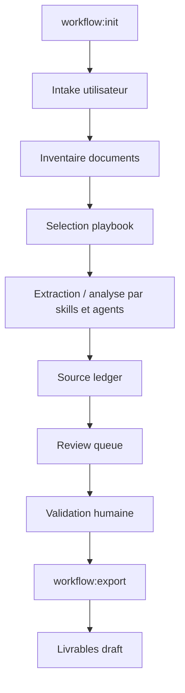

# Legal-FR Cowork Playbook Workflows Design

## Goal

Turn Legal-FR from a catalogue of Claude Desktop/Cowork plugins into a workflow-grade legal product while staying fully compatible with the official Claude plugin model and the archived Financial Services plugin structure.

The core idea is simple: a playbook should not be only a rule grid. It should become the operational contract for a complete user workflow:

- what the user must provide;
- which documents are required;
- which skill or agent owns each step;
- which sources are allowed;
- which table columns and deliverables must be produced;
- which quality gates must pass;
- which findings require human validation.

## Validation Sources

This design is constrained by official Claude plugin/Cowork documentation and the local Financial Services reference structure.

Official documentation confirms:

- Plugins are reusable capability packages bundling MCP connectors, skills, slash commands, and sub-agents: <https://claude.com/docs/plugins/overview>
- A plugin directory contains `.claude-plugin/plugin.json`; `skills/`, `commands/`, `agents/`, hooks, and `.mcp.json` live at plugin root, not inside `.claude-plugin/`: <https://code.claude.com/docs/en/plugins-reference>
- A plugin root `CLAUDE.md` is not loaded as plugin context. Instructions that must load at runtime belong in skills, agents, or commands: <https://code.claude.com/docs/en/plugins-reference>
- Marketplace entries live in `.claude-plugin/marketplace.json` and point to plugin source directories: <https://code.claude.com/docs/en/plugin-marketplaces>
- Cowork users can install plugins from the Plugins settings surface, and plugins can bundle skills, hooks, slash commands, and sub-agents: <https://claude.com/docs/cowork/3p/extensions>
- Plugins can reference local or remote MCP servers; remote MCP is portable across Claude surfaces, while local MCP is desktop/code-oriented: <https://claude.com/docs/connectors/building/what-to-build>

Local Financial Services structure confirms the intended Cowork pattern:

```text
plugins/vertical-plugins/<vertical>/
  .claude-plugin/plugin.json
  commands/*.md
  skills/<skill>/SKILL.md
  .mcp.json
  hooks/hooks.json

plugins/agent-plugins/<agent>/
  .claude-plugin/plugin.json
  agents/<agent>.md
  skills/<skill>/SKILL.md
```

Legal-FR must keep this shape.

## Non-Goals

- Do not build a separate workflow engine outside the plugin structure.
- Do not rely on plugin-root `CLAUDE.md` for runtime behavior.
- Do not add Managed Agent cookbooks in this phase.
- Do not require external SaaS setup to run deterministic validation.
- Do not make MCP calls mandatory for structural tests.
- Do not replace `jurisprudence-multilingue`; it remains the multilingual and comparative legal research workflow.

## Product Principle

Legal-FR should feel less like a general legal chat interface and more like a set of controlled legal workbenches.

Each workflow must produce:

- a structured intake record;
- a document inventory;
- a source ledger;
- a table of findings;
- an action queue for the practitioner;
- draft deliverables;
- human validation metadata.

Every output remains `DRAFT - Validation professionnelle requise`.

## Architecture

Add a native plugin workflow layer inside the active `legal-fr` vertical:

```text
plugins/vertical-plugins/legal-fr/
  commands/
    workflow/
      init.md
      run.md
      review.md
      export.md
      eval.md
  skills/
    workflow-playbooks/
      SKILL.md
      references/
        playbook-v2-format.md
        workflow-lifecycle.md
        workflow-registry.md
    source-ledger/
      SKILL.md
      references/
        source-ledger-format.md
    review-queue/
      SKILL.md
      references/
        review-queue-format.md
  playbooks/
    workflows/
      workflow-dd-ma.md
      workflow-audit-rh.md
      workflow-preparation-audience.md
      workflow-audit-baux.md
      workflow-conformite-fournisseurs.md
      workflow-recherche-source-first.md
  schemas/
    common/
      workflow-run.schema.json
      review-queue.schema.json
      source-ledger.schema.json
    workflows/
      workflow-dd-ma/
        run.schema.json
        deliverables.schema.json
      ...
```

Agent plugins stay self-contained. If an agent prompt references `workflow-playbooks`, `source-ledger`, or `review-queue`, the corresponding skill directories must be bundled into that agent plugin.

## Component Responsibilities

### Playbooks

Playbooks are reference files and workflow contracts. They are not code and they do not execute anything directly.

They define:

- intake questions;
- required documents;
- workflow steps;
- relevant agents and skills;
- source hierarchy;
- table schema;
- red flags;
- quality gates;
- deliverables;
- validation rules.

### Skills

Skills hold durable reusable behavior.

- `workflow-playbooks`: read a workflow playbook, ask missing intake questions, route steps, and enforce the lifecycle.
- `source-ledger`: maintain source provenance for each finding and conclusion.
- `review-queue`: convert findings into human-review tasks with severity, owner, status, and action.

### Commands

Commands are the Cowork user entry points.

- `workflow:init`: create a workflow run from a playbook and intake.
- `workflow:run`: execute the next workflow stage or full allowed flow.
- `workflow:review`: surface findings requiring human validation.
- `workflow:export`: generate final draft deliverables from validated or partially validated state.
- `workflow:eval`: run workflow-specific sample cases and compare expected fields.

### Agents

Agents are the end-to-end Cowork specialists.

They should reference workflow playbooks when a user asks for complete delegation, but they must still expose natural legal workflows:

- `tabular-due-diligence` owns DD corpus execution;
- `revue-contrats-travail` owns HR audit execution;
- `chronologie-contentieux` owns timeline and audience preparation;
- `red-flags-bail` owns lease review;
- `recherche-juridique-fr-avancee` owns source-first French legal research.

## Playbook V2 Format

Every V2 workflow playbook should use this structure:

```markdown
---
name: workflow-dd-ma
version: 2.0.0
workflow_type: due-diligence
jurisdiction: FR
primary_agent: tabular-due-diligence
status: draft
---

# Workflow - Due Diligence M&A FR

## Intake
| Champ | Question | Requis | Exemple |
|---|---|---|---|

## Documents Requis
| Document | Obligatoire | Bloquant si absent | Notes |
|---|---|---|---|

## Sources Autorisees
| Source | Usage | Priorite | Statut |
|---|---|---|---|

## Agents Et Skills
| Etape | Agent/skill | Role | Sortie attendue |
|---|---|---|---|

## Etapes Workflow
| Ordre | Etape | Entree | Sortie | Gate |
|---|---|---|---|---|

## Tableau Principal
| Colonne | Description | Source requise | Confiance minimale |
|---|---|---|---|

## Red Flags
| ID | Pattern | Gravite | Action praticien |
|---|---|---|---|

## Quality Gates
| Gate | Critere | Echec si |
|---|---|---|

## Livrables
| Livrable | Format | Audience | Condition |
|---|---|---|---|

## Validation Humaine
| Element | Reviewer | Statut attendu |
|---|---|---|
```

## Workflow Lifecycle



The lifecycle is implemented by command instructions and skills, not by a separate application server.

## Initial Workflow Packs

### workflow-dd-ma

Uses:

- `tabular-due-diligence`
- `analyse-contrats-fournisseurs`
- `revue-contrats-travail`
- `red-flags-bail`
- `recherche-juridique-fr-avancee`

Deliverables:

- data room inventory;
- tabular DD table;
- top red flags;
- missing documents request list;
- executive DD report;
- source ledger.

### workflow-audit-rh

Uses:

- `revue-contrats-travail`
- `recherche-juridique-fr-avancee`

Deliverables:

- contract corpus table;
- IDCC and collective-bargaining issue list;
- non-compete validity table;
- compensation/minimum compliance table;
- remediation plan.

### workflow-preparation-audience

Uses:

- `chronologie-contentieux`
- `jurisprudence-multilingue`
- `recherche-juridique-fr-avancee`

Deliverables:

- chronology;
- evidence map;
- contradictions list;
- procedural deadlines check;
- audience brief;
- legal authorities table.

### workflow-audit-baux

Uses:

- `red-flags-bail`
- `tabular-due-diligence`
- `recherche-juridique-fr-avancee`

Deliverables:

- lease portfolio table;
- renewal calendar;
- Pinel charges review;
- non-standard clauses table;
- action plan.

### workflow-conformite-fournisseurs

Uses:

- `revue-conformite-interne`
- `analyse-contrats-fournisseurs`
- `recherche-juridique-fr-avancee`

Deliverables:

- supplier compliance table;
- renewal and alert calendar;
- playbook gap report;
- negotiation action list.

### workflow-recherche-source-first

Uses:

- `recherche-juridique-fr-avancee`
- `jurisprudence-multilingue` when multilingual, comparative, CJUE, CEDH, or translation needs appear.

Deliverables:

- research memo;
- official-source table;
- proposition/source excerpt side-by-side table;
- uncertainty register;
- source audit.

## Data And Output Schemas

Add common schemas:

- `workflow-run.schema.json`: run ID, playbook, status, intake, document inventory, current stage.
- `source-ledger.schema.json`: finding ID, source type, source locator, excerpt, status, confidence.
- `review-queue.schema.json`: finding ID, severity, owner role, action, validation status.

Each workflow pack can add specialized schemas for deliverables, but should reuse common schema references.

## Quality Model

Each material finding must include:

- `finding_id`;
- `source_status`;
- `source_excerpt`;
- `confidence`;
- `risk_level`;
- `action_praticien`;
- `validated_by_human`;
- `DRAFT - Validation professionnelle requise`.

The product must optimize for fewer black-box conclusions. Tables should show why a row exists and where it came from.

## Compatibility With Cowork

This design uses only native plugin components:

- skills for persistent instructions;
- commands for slash entry points;
- agents for delegated workflows;
- `.mcp.json` for connectors;
- marketplace entries for installation.

No plugin-root `CLAUDE.md` is required for runtime behavior. Root and plugin `CLAUDE.md` files may remain as documentation for repository users, but production workflow instructions must live in skills, commands, or agents.

## Acceptance Criteria

- New workflow files live under the active `legal-fr` vertical plugin.
- New behavior is exposed through `commands/workflow/*.md`.
- Runtime instructions are present in skills, commands, and agents, not only in `CLAUDE.md`.
- Agent plugins that reference new workflow skills bundle them self-contained.
- `scripts/check.py` validates new plugin files.
- Existing Legal-FR tests still pass.
- New tests verify playbook V2 sections, workflow commands, common schemas, and agent bundle references.
- No deterministic test requires external API credentials.

## Implementation Strategy

1. Add tests for Playbook V2, workflow command presence, common schemas, and bundle consistency.
2. Add `workflow-playbooks`, `source-ledger`, and `review-queue` skills.
3. Add `commands/workflow/*.md`.
4. Add workflow playbooks under `playbooks/workflows/`.
5. Add schemas under `schemas/common/` and workflow folders.
6. Update Legal-FR docs and agent prompts to reference the workflow layer.
7. Regenerate or manually sync agent plugin skill bundles.
8. Run deterministic validations and evals.

## Open Questions

- Whether workflow playbooks should be installed only in the `legal-fr` vertical or duplicated into each agent plugin as references.
- Whether `workflow:run` should always run one stage at a time or allow a full run when all required intake and documents are present.
- Whether commercial bundles should be represented as marketplace plugin groups or documented install recipes.

Recommended default:

- Keep source playbooks in `legal-fr`.
- Bundle only the shared workflow skills into agent plugins.
- Let commands run one stage by default and support full execution only when the command text explicitly permits it.
- Represent commercial bundles as documentation first, not marketplace mechanics.
